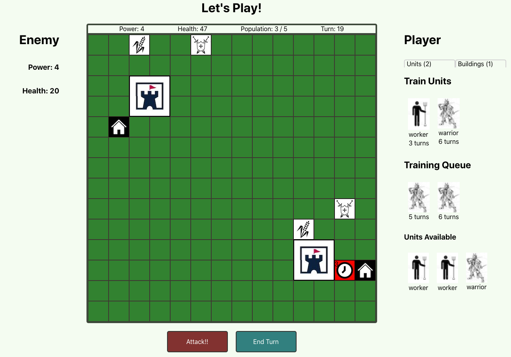

<h1>Foundation</h1>

Its here: https://cocky-panini-e70579.netlify.app

<h2><u>Overview:</u></h2>

In foundation you are playing against an evil AI that is trying to conquer your land. The setup is simple but the unknowable nature of your opponent makes success difficult. You must build your city and yrain your people to fight. When you're ready, ATTACK, and defeat your enemy.

 
    
<h2><u>The Team:</u></h2>
<h3>Eric Schorling: https://github.com/ericschorling</h3>

Find him online at: https://ericschorling.dev

<b>Primary Team Role:</b>Lead Developer and Data Scientist

<b>Contributions:</b> Built the whole thing. Developed game logic. Created design, such as it is.

 

<h2><u>What We Used:</u></h2>
<h3>Languages:</h3>
<ul>
    <li>HTML5</li>
    <li>CSS</li>
    <li>JavaScript</li>
    <li>React</li>
    <li>Redux</li>
</ul>
 

<h2><u>MVP (Minimum Viable Product):</u></h2>
<ul>
    <li>Functional Game that has a specific win condition</li>
    <li>Ability to play multiple games.</li>
    <li>Able to travel around the site and not lose your place in the game.</li>
</ul>
 

<h2><u>Stretch Goals Completed:</u></h2>
<ul>
    <li>Change in the turns based on building built</li>
    <li>Enemy play logic that is not predetermined.</li>
    <li>Ability to cancel buildings from gameboard.</li>
</ul>
 

<h2><u>Stretch Goals Future:</u></h2>
<ul>
    <li>Add in additional units and buildings.</li>
    <li>Allow player to "spy".</li>
    <li>Advance the play mechanics and AI logic.</li>
    <li>Add backend to store global variables and add save feature.</li>
</ul>
 

<h2><u>Challenges & Solutions:</u></h2>
<h3>Some of the biggest challenges we faced with this project build included:</h2>
 

<b>Challenge:</b> Build the game board to accept changes. 

<b>Solution:</b>Utilized Redux to save state. Included ways for the board to update but also stayed static as the game was played, only rerendered on refresh. Utilized a grid of divs rather than trying to build one large item and then updating that.

 

<b>Challenge:</b> Create an AI that plays the game.

<b>Solution:</b> Wanted to make it a single player experience that didn't require any actions by the player. Built out the game logic as if it was played by the player and utilized probabilities and random number generators to provide for a unique experience. 

 

<h2><u>Screenshots:</u></h2>

<h3>Game Board</h3>

<h3>Played Game</h3>

<h3>Enemy Attack</h3>
